# RFC-0041: Fintech-Scale Notification Infrastructure
**Status:** Draft for Architecture Review  
**Authors:** Olalekan Ogundimu  
**Created:** 2026-05-27  
**Target:** 1M+ active users, multi-channel delivery (Push / SMS / Email)

---

## Table of Contents

1. [Executive Summary](#1-executive-summary)
2. [Problem Statement](#2-problem-statement)
3. [Functional Requirements](#3-functional-requirements)
4. [Non-Functional Requirements](#4-non-functional-requirements)
5. [Assumptions and Constraints](#5-assumptions-and-constraints)
6. [High-Level Architecture](#6-high-level-architecture)
7. [End-to-End Notification Flow](#7-end-to-end-notification-flow)
8. [Component Breakdown](#8-component-breakdown)
9. [Queueing and Event-Driven Design](#9-queueing-and-event-driven-design)
10. [Reliability Guarantees](#10-reliability-guarantees)
11. [Idempotency Strategy](#11-idempotency-strategy)
12. [Retry Strategy](#12-retry-strategy)
13. [Dead Letter Queues](#13-dead-letter-queues)
14. [Reconciliation Workers](#14-reconciliation-workers)
15. [Provider Failover Design](#15-provider-failover-design)
16. [Circuit Breaker Strategy](#16-circuit-breaker-strategy)
17. [Notification State Machine](#17-notification-state-machine)
18. [Database Schema Design](#18-database-schema-design)
19. [Recommended PostgreSQL Indexes](#19-recommended-postgresql-indexes)
20. [Scaling Strategy](#20-scaling-strategy)
21. [Multi-Region Considerations](#21-multi-region-considerations)
22. [Observability and Monitoring](#22-observability-and-monitoring)
23. [Security Considerations](#23-security-considerations)
24. [Trade-Off Analysis](#24-trade-off-analysis)
25. [Failure Scenario Walkthroughs](#25-failure-scenario-walkthroughs)
26. [Future Improvements](#26-future-improvements)
27. [Final Recommendation](#27-final-recommendation)

---

## 1. Executive Summary

This RFC defines the architecture for a production-grade notification infrastructure capable of reliably delivering push notifications, SMS, and email at the scale of 1M+ users. The system is designed for a fintech context, where a missed payment alert or a duplicate security notification both represent real product failures — not edge cases to handle in a v2.

The core design philosophy: **at-least-once delivery with deterministic deduplication is the right model**. Exactly-once delivery is not achievable across distributed systems and third-party providers without unacceptable latency trade-offs. We accept that duplicate sends may be attempted, and we prevent them from reaching the user via idempotency keys, delivery state tracking, and provider-level deduplication headers where supported.

Key design decisions at a glance:

- Kafka as the durable event spine, with per-channel consumer groups
- PostgreSQL as the authoritative notification state store; Redis for fast idempotency checks
- Pluggable provider adapters behind a routing layer with circuit breakers and automatic failover
- Reconciliation workers that run out-of-band to close the loop on ambiguous delivery states
- Horizontal pod autoscaling in Kubernetes, partitioned by `user_id` to preserve per-user ordering where needed

---

## 2. Problem Statement

The existing notification path is a synchronous API call from the application service directly to each provider. This works at low volume but creates several failure modes we've already hit in production:

**Missed notifications** occur when the provider call times out and the calling service has no retry mechanism or durable record of the intent. If the app server restarts mid-request, the notification is silently dropped.

**Duplicate sends** occur during retry storms. When a Twilio or FCM call succeeds on the provider side but the HTTP response is lost in transit, the caller retries and the user receives the same message twice. For payment confirmations or fraud alerts, this erodes trust.

**No visibility** into delivery state. There is currently no structured record of whether a notification was attempted, which provider handled it, what the response was, or whether the user actually received it. Debugging a missed notification requires combing through application logs across multiple services.

**Provider coupling** means a Sendgrid outage takes down email entirely. There is no fallback, no circuit breaker, no graceful degradation.

**Bulk sends** (product announcements, compliance notices) are handled by one-off scripts that hammer the provider API directly with no rate limiting, backpressure management, or observability.

At 1M users with financial-grade notification requirements, none of these are acceptable. This RFC defines the system that replaces the current approach.

---

## 3. Functional Requirements

**F1 — Channel Support**  
The system must support push (FCM, APNs), SMS (Twilio, Vonage), and email (Sendgrid, SES) as delivery channels. Channel selection per notification type is configurable at runtime without a deploy.

**F2 — Real-Time Notifications**  
Triggered notifications (payment received, fraud alert, login from new device) must be dispatched within 5 seconds of the triggering event under normal operating conditions.

**F3 — Bulk Notifications**  
The system must support fan-out sends to cohorts of up to 1M users. Bulk jobs must be rate-controlled, observable, and pausable without message loss.

**F4 — User Preference Enforcement**  
Per-user channel preferences and opt-outs must be evaluated before dispatch. An opted-out user must never receive notifications via their opted-out channel regardless of the send path used.

**F5 — Delivery Tracking**  
Every notification must have a lifecycle record. The system must track: created, queued, dispatched, delivered (where provider webhooks support it), failed, and dead-lettered states.

**F6 — Deduplication**  
A notification with the same logical identity must not be delivered more than once within a 24-hour window, even if retried multiple times or submitted via multiple code paths.

**F7 — Multi-Provider Routing**  
Each channel must support at least two providers. Provider selection must be configurable (primary/fallback) and automated under failure conditions.

**F8 — Retry and DLQ**  
Failed notifications must be retried with exponential backoff. After exhausting retries, messages must be routed to a dead letter queue for inspection and potential manual replay.

**F9 — Webhook Ingestion**  
The system must accept delivery receipts and bounce/failure webhooks from providers and update notification state accordingly.

**F10 — Admin Operations**  
Engineering and ops must be able to: inspect notification state, manually replay DLQ messages, cancel pending bulk jobs, and view per-provider error rates.

---

## 4. Non-Functional Requirements

| Requirement | Target |
|---|---|
| API P99 latency (enqueue) | < 50ms |
| Notification dispatch latency (P95) | < 5s from event |
| Throughput (sustained) | 50,000 notifications/min |
| Throughput (burst, bulk) | 500,000 notifications/min |
| Durability | No message loss after acknowledgement to producer |
| Availability | 99.9% (notification enqueue endpoint) |
| Deduplication window | 24 hours |
| Retry exhaustion time | ≤ 4 hours |
| DLQ retention | 7 days |
| Reconciliation lag | ≤ 15 minutes for stuck-in-flight notifications |
| Observability | End-to-end distributed trace per notification |

Availability is defined at the enqueue layer. Provider delivery availability is bounded by provider SLAs and is explicitly outside our control, which is why the failover and reconciliation designs exist.

---

## 5. Assumptions and Constraints

- **Kafka** is available as the managed event streaming layer (Confluent Cloud or MSK). RabbitMQ is a viable alternative but loses partition-level ordering guarantees that we rely on for per-user sequencing.
- **PostgreSQL 15+** is the operational database. We are not introducing a separate NoSQL store for notification state; the schema and indexing strategy in §18-19 are designed to make Postgres work well at this volume.
- **Redis 7+** (cluster mode) is available for fast idempotency lookups and rate limiting. Data in Redis is treated as a cache — Postgres is the source of truth.
- Provider SDK clients are **not** used directly in worker code. All providers are accessed via internal adapter interfaces (§8.5), which allows mocking, circuit breaking, and provider swapping without touching worker logic.
- We **do not** guarantee delivery to the user's device. We guarantee delivery of the dispatch attempt to the provider, with confirmed receipt. Final-mile delivery (e.g., device offline, user uninstalls app) is out of scope for SLA purposes.
- The system does **not** render notification content. Template rendering happens upstream at the Notification Service layer. Workers receive fully-rendered payloads.
- **Multi-tenancy** is out of scope for this version. This is a single-product notification infrastructure.

---

## 6. High-Level Architecture

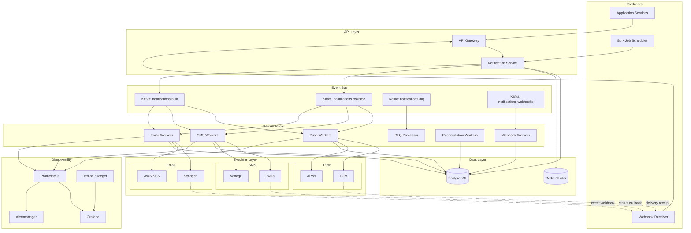

The critical design constraint here is that the Notification Service is **write-only** on the hot path. It writes to Postgres (the authoritative record), checks Redis for deduplication, and publishes to Kafka. It does not wait for the worker to attempt delivery before returning a response to the caller. This keeps the enqueue P99 under 50ms regardless of provider health.

---

## 7. End-to-End Notification Flow

### 7.1 Real-Time Notification Flow

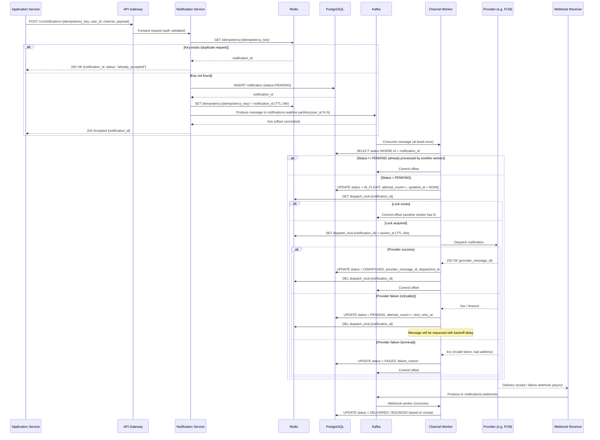

### 7.2 Bulk Fan-Out Flow

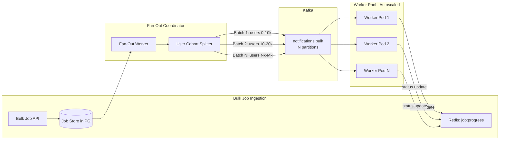

The Fan-Out Coordinator reads the target cohort from Postgres in streaming batches of 10,000 users. For each user, it writes a `notification` row and emits a Kafka message. It does not wait for any delivery confirmation. Progress is tracked via atomic increments in Redis (`INCR job:{job_id}:dispatched`).

The coordinator deliberately produces to the `bulk` topic, not `realtime`. These are separate consumer groups with separate worker pools and separate rate limiters against provider APIs. A bulk send cannot starve a fraud alert.

---

## 8. Component Breakdown

### 8.1 API Gateway

Standard JWT validation, rate limiting (per-caller, not per-user), and TLS termination. The gateway does not have notification-specific logic. Rate limiting on the enqueue endpoint is set generously (10k req/s per service account) because the Notification Service itself handles deduplication — the gateway just needs to stop clearly abusive or misconfigured callers.

### 8.2 Notification Service

The entry point for all notification creation. Its only responsibilities are:

1. Parse and validate the incoming request
2. Resolve user preferences (channel opt-outs, device tokens) — read from Redis, fallback to Postgres
3. Check the idempotency key in Redis
4. Write the canonical `notification` record to Postgres with `status = PENDING`
5. Publish to the appropriate Kafka topic
6. Return `202 Accepted` with the `notification_id`

It does **not** dispatch notifications. It does not call providers. It is stateless and scales horizontally behind the API Gateway.

### 8.3 Kafka Topics

| Topic | Partitions | Retention | Consumer Groups |
|---|---|---|---|
| `notifications.realtime` | 64 | 24h | push-workers, sms-workers, email-workers |
| `notifications.bulk` | 128 | 48h | push-workers-bulk, sms-workers-bulk, email-workers-bulk |
| `notifications.dlq` | 16 | 7 days | dlq-processor |
| `notifications.webhooks` | 32 | 24h | webhook-workers |

Partitioning on `user_id % N` ensures that all messages for a given user land on the same partition, preserving ordering within a user's notification stream. This matters for rate limiting (we don't want two workers simultaneously sending SMS to the same user) and for state machine coherence.

### 8.4 Worker Pools

Each channel has its own worker pool. Workers are stateless Kubernetes Deployments with HPA configured against Kafka consumer lag (exposed via Prometheus via the Kafka exporter). The lag threshold is tuned per pool — push workers tolerate more lag than SMS workers because push delivery is less time-sensitive for most notification types.

Workers do not contain channel-specific logic beyond selecting the right provider adapter. All business logic (retries, state transitions, locking) lives in a shared `NotificationProcessor` library.

### 8.5 Provider Adapters

Each provider is wrapped in an adapter that conforms to a single interface:

```typescript
interface ProviderAdapter {
  send(notification: DispatchPayload): Promise<ProviderResult>;
  supports(channel: Channel): boolean;
  name(): string;
}

interface ProviderResult {
  success: boolean;
  providerMessageId?: string;
  retryable: boolean;
  errorCode?: string;
  errorMessage?: string;
}
```

The adapter handles provider-specific serialization, HTTP retries at the transport level (separate from our application-level retry logic), and maps provider error codes to our internal error taxonomy.

**Transport-level retries** (handled by the adapter's HTTP client): 3 attempts, 100ms fixed backoff. These cover transient TCP errors and are transparent to the worker.

**Application-level retries** (handled by the worker + retry queue): cover sustained provider unavailability and are described in §12.

### 8.6 Redis Usage

| Key Pattern | Purpose | TTL |
|---|---|---|
| `idempotency:{key}` | Maps idempotency key → notification_id | 24h |
| `dispatch_lock:{notification_id}` | Prevents concurrent dispatch of same notification | 30s |
| `user_prefs:{user_id}` | Cached user channel preferences | 5min |
| `device_tokens:{user_id}` | Cached push device tokens | 5min |
| `circuit:{provider_name}` | Circuit breaker state (CLOSED/OPEN/HALF_OPEN) | dynamic |
| `rate_limit:sms:{user_id}` | Per-user SMS rate limiting (sliding window) | 1h |
| `job:{job_id}:dispatched` | Bulk job dispatch counter | 72h |

### 8.7 Reconciliation Worker

A separate, low-priority worker that runs on a 5-minute cron. It queries Postgres for notifications stuck in `IN_FLIGHT` or `PENDING` states past their expected timeout window, and re-evaluates them. Described in detail in §14.

### 8.8 Webhook Receiver

A lightweight HTTP service that accepts inbound webhooks from providers. It validates the webhook signature (HMAC-SHA256 for Twilio; JWT for Sendgrid), normalizes the payload into our internal `DeliveryReceipt` format, and publishes to `notifications.webhooks`. It does not write to Postgres directly — that is the webhook worker's job.

---

## 9. Queueing and Event-Driven Design

### 9.1 Queue/Worker Topology

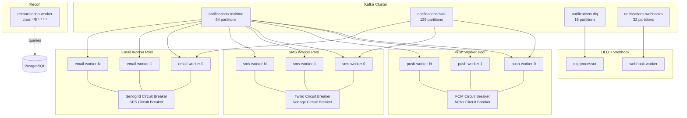

### 9.2 Backpressure Management

Kafka consumers apply backpressure naturally — if a worker is slow to process, it stops consuming from the partition until it catches up. Consumer lag grows but messages are not lost.

However, unbounded lag growth is a problem. We manage it in two ways:

**Worker autoscaling**: HPA watches the `kafka_consumer_lag` metric per consumer group. If lag on any partition exceeds 5,000 messages for more than 2 minutes, new worker pods are launched. Maximum pod count is capped to avoid overwhelming providers with sudden traffic spikes.

**Provider-side rate limiting**: Each provider adapter enforces a configurable requests-per-second limit using a Redis token bucket. This is especially important for SMS, where Twilio enforces hard per-account rate limits. Exceeding those limits results in 429 errors that look like failures and trigger retries, making the problem worse. We stay under the limit by design.

### 9.3 Consumer Group Isolation

Realtime and bulk workloads share the same worker code but consume from different topics with different consumer groups. This is critical. A bulk job that produces 1M messages to `notifications.bulk` will cause significant consumer lag on that topic. If bulk and realtime shared a topic, that lag would delay fraud alerts and payment confirmations. With separate topics, the realtime consumer group is completely unaffected.

### 9.4 Poison Message Handling

A poison message is a message that consistently causes the consumer to crash or throw an unhandled exception before it can be committed. Without handling, this causes the consumer to get stuck indefinitely on the same offset.

Our workers wrap each message processing in a try/catch. If a message fails with an unexpected error (not a provider error — those follow the retry path) more than 3 times, it is:

1. Published to `notifications.dlq` with the original payload plus error context
2. The offset is committed so the consumer moves forward

This prevents one bad message from stalling an entire partition. The DLQ processor handles these messages separately (§13).

---

## 10. Reliability Guarantees

### 10.1 Why Exactly-Once Delivery Is Unrealistic

Exactly-once delivery requires that a message is processed by a consumer exactly one time, with no duplicates and no omissions. In a closed system with a single database, you can approximate this with transactions. Across a distributed system involving Kafka, Postgres, Redis, a worker process, and a third-party HTTP API, it is not achievable without either:

- Making every operation synchronous and two-phase, which kills latency and throughput
- Accepting that provider calls may succeed but the acknowledgement is lost, creating a state where you must either retry (risk duplicate) or give up (miss delivery)

There is no third option. The provider does not participate in your distributed transaction. When you call `POST https://api.twilio.com/Messages`, you get a result, but the result can be lost in transit. Your options are retry or skip. Retry is correct.

### 10.2 At-Least-Once + Deduplication

Our delivery guarantee is **at-least-once delivery at the dispatch layer, with best-effort deduplication at the user-visible layer**.

- Kafka provides at-least-once delivery to consumers (messages are re-delivered if a consumer crashes before committing the offset)
- Workers check idempotency state before dispatching to prevent duplicate provider calls
- Providers that support idempotency keys (Sendgrid's `X-Message-Id`, Twilio's `X-Twilio-IdempotencyKey`) receive them on every attempt
- The 30-second dispatch lock in Redis prevents two worker instances from simultaneously dispatching the same notification

The practical implication: a notification may be dispatched twice to a provider in the event of a worker crash between dispatch and offset commit. This is rare. Provider-side deduplication keys handle it when supported. When not supported, we accept that a small number of notifications may be delivered twice under failure conditions. This is disclosed in the SLA as a known limitation.

### 10.3 Durability Guarantees

Once the Notification Service writes the `notification` row to Postgres and receives a Kafka produce acknowledgement (`acks=all`), the notification will be delivered or dead-lettered. There is no code path that silently drops it after that point.

If Kafka is unavailable during enqueue, the Notification Service returns a 503 and the caller is responsible for retry. We do not buffer in-process.

---

## 11. Idempotency Strategy

### 11.1 Idempotency Key Design

Every API caller must provide an `idempotency_key` on notification requests. The recommended format is `{service_name}:{event_type}:{entity_id}:{timestamp_bucket}`, e.g.:

```
payments-service:payment_received:txn_8f3k2j9:2026052714
```

The timestamp bucket (hour-granular) allows the same logical event to produce a new notification after 24 hours (e.g., a daily digest) while still deduplicating within a send window.

### 11.2 Two-Layer Deduplication

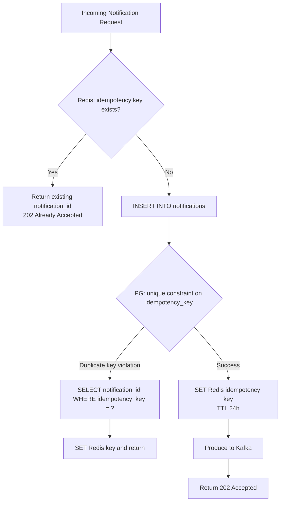

The Redis check is the fast path — it prevents a Postgres round-trip for duplicate requests. The Postgres unique constraint is the safety net for cases where the Redis key has expired or was evicted (Redis is not durable by default in this configuration).

### 11.3 Worker-Level Idempotency

Before any provider call, the worker reads the current notification status from Postgres. If the status is anything other than `PENDING` or `IN_FLIGHT`, the message is acknowledged and skipped. This handles the case where Kafka re-delivers a message that was already processed (consumer committed the offset but a crash caused replay).

```typescript
async function processNotification(msg: KafkaMessage): Promise<void> {
  const notification = await db.notifications.findById(msg.notificationId);

  if (!notification) {
    // Should never happen after the write path, but guard anyway
    logger.error({ notificationId: msg.notificationId }, 'notification_not_found');
    return; // ack the message, nothing we can do
  }

  if (['DISPATCHED', 'DELIVERED', 'FAILED', 'CANCELLED'].includes(notification.status)) {
    // Already processed — Kafka is re-delivering a message we already handled
    metrics.increment('worker.skipped.already_processed', { channel: notification.channel });
    return;
  }

  // Acquire dispatch lock
  const lockKey = `dispatch_lock:${notification.id}`;
  const acquired = await redis.set(lockKey, workerId, 'NX', 'EX', 30);
  if (!acquired) {
    // Another worker is handling this right now
    metrics.increment('worker.skipped.lock_contention');
    return;
  }

  try {
    await db.notifications.updateStatus(notification.id, 'IN_FLIGHT');
    const result = await providerAdapter.send(notification);
    await handleProviderResult(notification, result);
  } finally {
    await redis.del(lockKey);
  }
}
```

---

## 12. Retry Strategy

### 12.1 Retry Flow

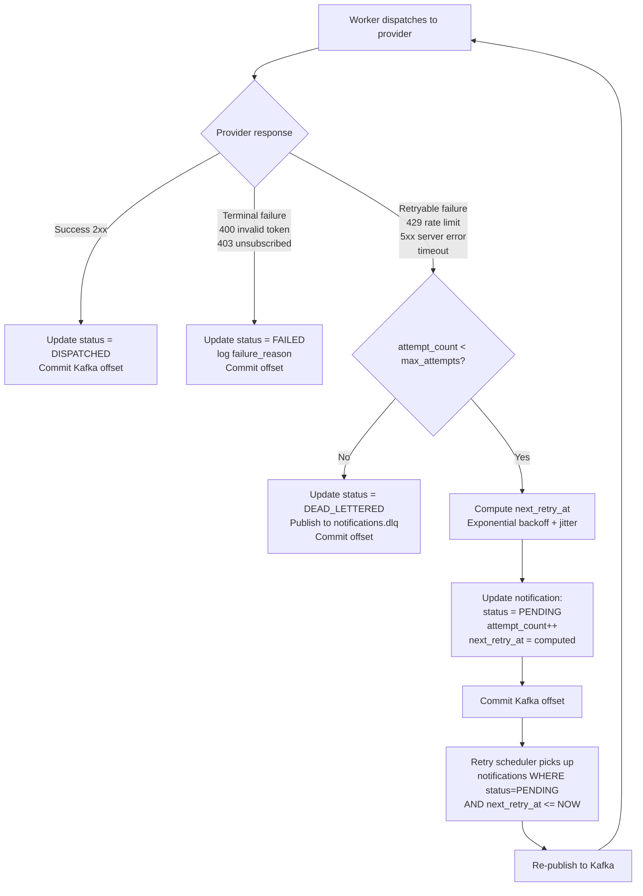

### 12.2 Backoff Calculation

```typescript
function computeNextRetry(attemptCount: number): Date {
  const baseDelayMs = 5_000; // 5 seconds
  const maxDelayMs = 3_600_000; // 1 hour cap
  const jitterFactor = 0.2; // ±20% jitter

  const exponential = baseDelayMs * Math.pow(2, attemptCount - 1);
  const capped = Math.min(exponential, maxDelayMs);
  const jitter = capped * jitterFactor * (Math.random() * 2 - 1);

  return new Date(Date.now() + capped + jitter);
}
```

| Attempt | Base Delay | Approx Time from First Attempt |
|---|---|---|
| 1 | 5s | T+5s |
| 2 | 10s | T+15s |
| 3 | 20s | T+35s |
| 4 | 40s | T+1m15s |
| 5 | 1m20s | T+2m35s |
| 6 | 2m40s | T+5m15s |
| 7 | 5m20s | T+10m35s |
| 8 | 10m40s | T+21m |
| 9 | 21m20s | T+42m |
| 10 | 42m40s | T+1h25m |

At 10 attempts, a notification is dead-lettered. The total retry window is approximately 4 hours, which satisfies the NFR.

### 12.3 Retry Scheduler

Retries are not re-queued to Kafka immediately after failure. They are scheduled via Postgres (`next_retry_at` column). A lightweight scheduler (single pod, no concurrency needed) runs every 30 seconds and does:

```sql
SELECT id, channel, payload
FROM notifications
WHERE status = 'PENDING'
  AND next_retry_at <= NOW()
  AND next_retry_at IS NOT NULL
ORDER BY next_retry_at
LIMIT 1000;
```

For each result, it publishes to the appropriate Kafka topic. This approach decouples retry timing from Kafka's polling semantics and avoids the need for Kafka delayed message plugins.

---

## 13. Dead Letter Queues

### 13.1 DLQ Architecture

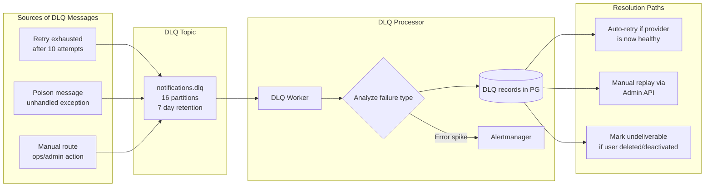

### 13.2 DLQ Record Schema

When a message lands in the DLQ, the processor writes a `notification_dlq_records` row:

```sql
CREATE TABLE notification_dlq_records (
    id              UUID PRIMARY KEY DEFAULT gen_random_uuid(),
    notification_id UUID NOT NULL REFERENCES notifications(id),
    reason          TEXT NOT NULL,         -- 'retry_exhausted' | 'poison_message' | 'manual'
    failure_detail  JSONB,                 -- last provider error, stack trace, etc.
    dlq_at          TIMESTAMPTZ NOT NULL DEFAULT NOW(),
    resolved_at     TIMESTAMPTZ,
    resolution      TEXT,                  -- 'replayed' | 'discarded' | 'auto_resolved'
    replayed_by     TEXT,                  -- operator email if manual
    INDEX           (notification_id),
    INDEX           (dlq_at),
    INDEX           (resolved_at) WHERE resolved_at IS NULL
);
```

### 13.3 Auto-Resolution Logic

The DLQ processor checks the circuit breaker state for the relevant provider. If the circuit is now closed (provider recovered), messages that failed due to provider unavailability are automatically re-published to the appropriate channel topic. This handles the common scenario of a Twilio outage: messages pile up in the DLQ, Twilio recovers, circuit closes, DLQ processor drains automatically without operator intervention.

Auto-resolution only fires for `reason = 'retry_exhausted'` AND `failure_detail.retryable = true`. Poison messages and terminal failures (invalid device tokens, unsubscribed addresses) are not auto-resolved.

---

## 14. Reconciliation Workers

### 14.1 What Reconciliation Solves

Notification status in Postgres can get stuck in intermediate states when workers crash mid-operation:

- `IN_FLIGHT` with no `dispatched_at`: worker crashed after updating status but before calling the provider
- `DISPATCHED` with no delivery receipt: provider webhook never arrived (Sendgrid webhook endpoint was down, Twilio retry window expired)
- `PENDING` with `next_retry_at` in the past: retry scheduler missed it (scheduler was restarting)

Reconciliation is the out-of-band process that identifies and resolves these stuck states.

### 14.2 Reconciliation Flow

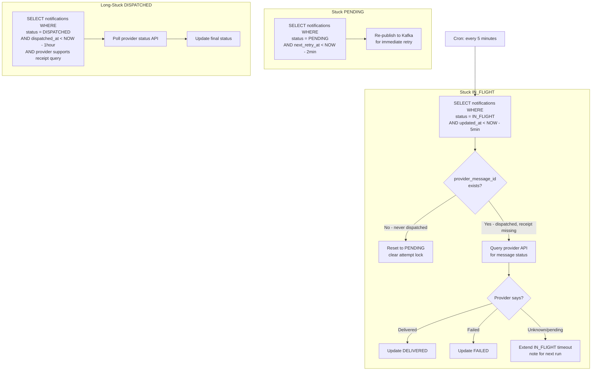

### 14.3 Provider Status Polling

Not all providers support status polling. Where supported:

| Provider | Status Query API |
|---|---|
| Twilio | `GET /2010-04-01/Accounts/{AccountSid}/Messages/{MessageSid}.json` |
| Sendgrid | Query activity feed API by `X-Message-Id` |
| FCM | No status query API — delivery receipts only |
| APNs | No status query API — delivery receipts only |

For FCM and APNs, `DISPATCHED` is the terminal state we can assert. Delivery to device is assumed unless an explicit failure webhook arrives. After 48 hours with no receipt, we transition to `DELIVERY_UNKNOWN` to indicate that we dispatched but cannot confirm.

### 14.4 Reconciliation Guardrails

The reconciliation worker has a hard limit: it will not touch more than 10,000 notifications per run. If it finds more, it alerts (this indicates a systemic backlog, not a minor catch-up) and processes the oldest ones. The worker also uses advisory locks (`pg_try_advisory_lock`) to ensure only one reconciliation instance runs at a time, even if the pod restarts.

---

## 15. Provider Failover Design

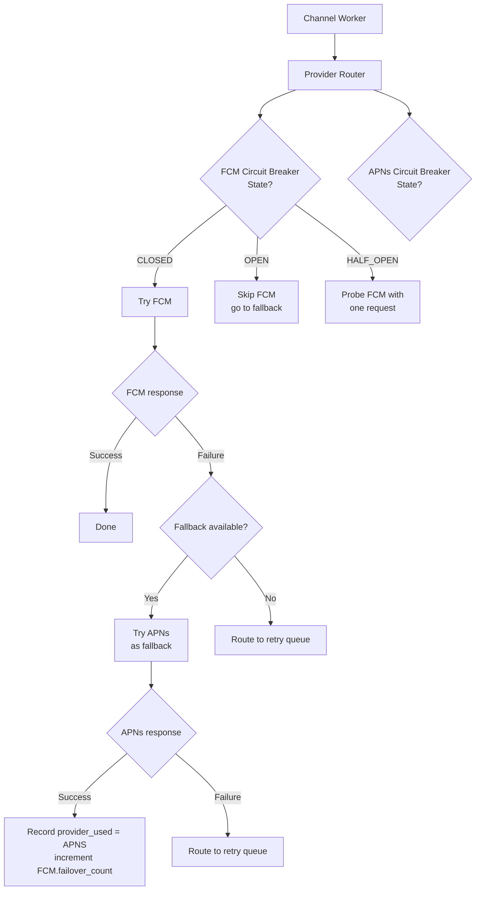

### 15.1 Provider Routing Configuration

Provider routing is defined in a configuration table, not hardcoded:

```sql
CREATE TABLE provider_routes (
    id              SERIAL PRIMARY KEY,
    channel         TEXT NOT NULL,          -- 'push_ios', 'push_android', 'sms', 'email'
    provider_name   TEXT NOT NULL,
    priority        INTEGER NOT NULL,       -- 1 = primary, 2 = secondary, etc.
    enabled         BOOLEAN DEFAULT TRUE,
    rate_limit_rps  INTEGER,               -- requests per second cap
    config          JSONB,                 -- provider-specific config (API keys via secret ref)
    UNIQUE (channel, provider_name)
);
```

This is loaded at worker startup and cached. Changes take effect within 60 seconds (cache TTL). This allows ops to disable a provider or swap primary/secondary without a deploy.

### 15.2 Failover Decision Logic

Failover is triggered at two levels:

**Per-request**: If a provider returns a 5xx or times out, the worker immediately tries the next provider in priority order. The original provider is not penalized at the circuit breaker level for a single failure.

**Circuit-level**: After a configurable threshold of failures within a time window, the circuit opens and the provider is bypassed entirely for all requests until the circuit tests recovery. See §16.

Failover is **not** triggered for 4xx errors. A 400 from Twilio means the request was malformed or the number is invalid — sending to Vonage will get the same result. 4xx errors are terminal failures.

---

## 16. Circuit Breaker Strategy

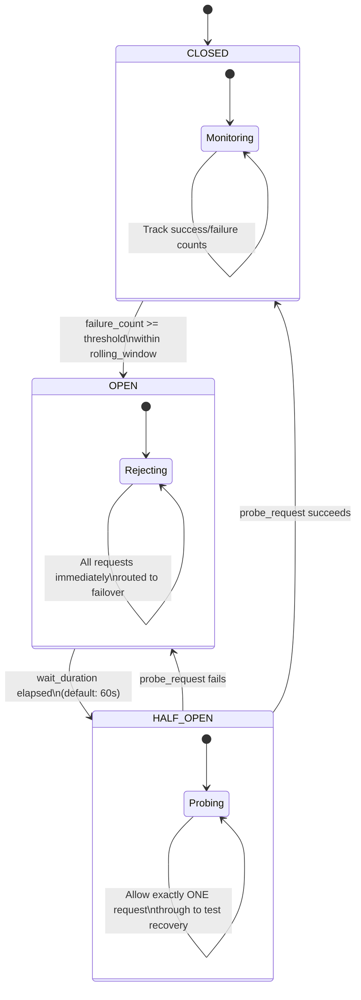

### 16.1 Circuit Breaker Parameters

| Parameter | Default | Notes |
|---|---|---|
| `failure_threshold` | 5 failures | Consecutive or within window |
| `failure_window` | 30 seconds | Rolling count window |
| `wait_duration` | 60 seconds | How long circuit stays OPEN |
| `probe_timeout` | 5 seconds | Timeout for HALF_OPEN probe request |
| `success_threshold` | 1 | Successes needed to close circuit |

Circuit state is stored in Redis with a key like `circuit:twilio:state`. This makes circuit state shared across all worker pods — if 3 workers are all seeing Twilio failures, the circuit opens once for all of them, not independently per pod.

### 16.2 Bulkhead Isolation

Provider circuit breakers are isolated per provider and per channel. A Twilio SMS circuit opening does not affect Vonage, and does not affect email providers. This is implemented via separate circuit instances keyed by `{provider}:{channel}`.

Without bulkhead isolation, a correlation bug where Twilio SMS failures are logged against the wrong circuit key could incorrectly open the Sendgrid email circuit. Defense in depth: all circuit state keys are namespaced and validated at write time.

---

## 17. Notification State Machine

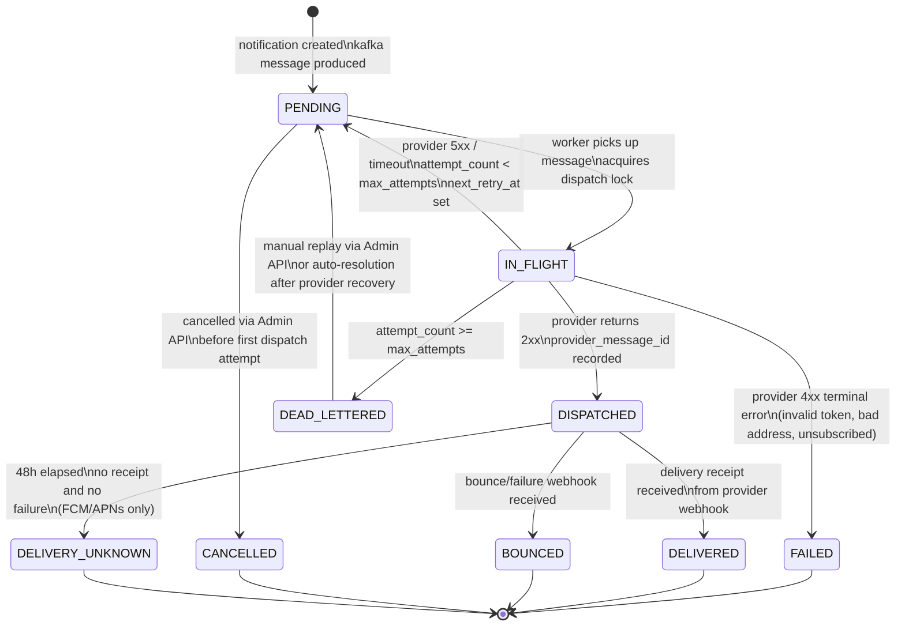

State transitions are enforced at the database level via a check constraint on `notifications.status` and an application-level transition table that rejects invalid state changes. A worker cannot transition a notification from `DELIVERED` back to `IN_FLIGHT` — if this is attempted (indicating a bug), it is logged as a critical error and the message is dead-lettered rather than processed.

---

## 18. Database Schema Design

```sql
-- Core notification record
CREATE TABLE notifications (
    id                  UUID PRIMARY KEY DEFAULT gen_random_uuid(),
    idempotency_key     TEXT NOT NULL UNIQUE,
    user_id             UUID NOT NULL,
    channel             TEXT NOT NULL CHECK (channel IN ('push_ios', 'push_android', 'sms', 'email')),
    status              TEXT NOT NULL DEFAULT 'PENDING' CHECK (status IN (
                            'PENDING', 'IN_FLIGHT', 'DISPATCHED', 'DELIVERED',
                            'FAILED', 'BOUNCED', 'DEAD_LETTERED', 'CANCELLED', 'DELIVERY_UNKNOWN'
                        )),
    payload             JSONB NOT NULL,             -- fully-rendered notification content
    metadata            JSONB,                      -- caller-provided context, trace IDs, etc.
    provider_name       TEXT,                       -- which provider handled the final dispatch
    provider_message_id TEXT,                       -- provider's own message ID (for receipt matching)
    attempt_count       INTEGER NOT NULL DEFAULT 0,
    max_attempts        INTEGER NOT NULL DEFAULT 10,
    next_retry_at       TIMESTAMPTZ,
    failure_reason      TEXT,
    created_at          TIMESTAMPTZ NOT NULL DEFAULT NOW(),
    updated_at          TIMESTAMPTZ NOT NULL DEFAULT NOW(),
    dispatched_at       TIMESTAMPTZ,
    delivered_at        TIMESTAMPTZ,
    expires_at          TIMESTAMPTZ                 -- null = never expires; set for time-sensitive alerts
);

-- Attempt log — one row per dispatch attempt
CREATE TABLE notification_attempts (
    id                  UUID PRIMARY KEY DEFAULT gen_random_uuid(),
    notification_id     UUID NOT NULL REFERENCES notifications(id) ON DELETE CASCADE,
    attempt_number      INTEGER NOT NULL,
    provider_name       TEXT NOT NULL,
    started_at          TIMESTAMPTZ NOT NULL,
    completed_at        TIMESTAMPTZ,
    outcome             TEXT CHECK (outcome IN ('SUCCESS', 'FAILURE', 'TIMEOUT')),
    provider_response   JSONB,                      -- raw provider response (sanitized)
    error_code          TEXT,
    retryable           BOOLEAN
);

-- Delivery receipts from provider webhooks
CREATE TABLE delivery_receipts (
    id                  UUID PRIMARY KEY DEFAULT gen_random_uuid(),
    notification_id     UUID REFERENCES notifications(id),
    provider_message_id TEXT,                       -- may arrive before we have notification_id
    provider_name       TEXT NOT NULL,
    event_type          TEXT NOT NULL,              -- 'delivered' | 'bounced' | 'failed' | 'complained'
    raw_payload         JSONB NOT NULL,
    received_at         TIMESTAMPTZ NOT NULL DEFAULT NOW(),
    processed           BOOLEAN NOT NULL DEFAULT FALSE
);

-- DLQ records
CREATE TABLE notification_dlq_records (
    id                  UUID PRIMARY KEY DEFAULT gen_random_uuid(),
    notification_id     UUID NOT NULL REFERENCES notifications(id),
    reason              TEXT NOT NULL,
    failure_detail      JSONB,
    dlq_at              TIMESTAMPTZ NOT NULL DEFAULT NOW(),
    resolved_at         TIMESTAMPTZ,
    resolution          TEXT,
    replayed_by         TEXT
);

-- Bulk notification jobs
CREATE TABLE bulk_notification_jobs (
    id                  UUID PRIMARY KEY DEFAULT gen_random_uuid(),
    name                TEXT NOT NULL,
    channel             TEXT NOT NULL,
    template_id         TEXT NOT NULL,
    cohort_query        JSONB NOT NULL,             -- query params defining target user set
    status              TEXT NOT NULL DEFAULT 'PENDING',
    total_users         INTEGER,
    dispatched_count    INTEGER NOT NULL DEFAULT 0,
    failed_count        INTEGER NOT NULL DEFAULT 0,
    rate_limit_rps      INTEGER NOT NULL DEFAULT 1000,
    created_by          TEXT NOT NULL,
    created_at          TIMESTAMPTZ NOT NULL DEFAULT NOW(),
    started_at          TIMESTAMPTZ,
    completed_at        TIMESTAMPTZ,
    cancelled_at        TIMESTAMPTZ
);

-- User notification preferences
CREATE TABLE user_notification_preferences (
    user_id             UUID NOT NULL,
    channel             TEXT NOT NULL,
    notification_type   TEXT NOT NULL,             -- 'payment', 'security', 'marketing', etc.
    enabled             BOOLEAN NOT NULL DEFAULT TRUE,
    updated_at          TIMESTAMPTZ NOT NULL DEFAULT NOW(),
    PRIMARY KEY (user_id, channel, notification_type)
);

-- Auto-update updated_at on notifications
CREATE OR REPLACE FUNCTION update_updated_at()
RETURNS TRIGGER AS $$
BEGIN
    NEW.updated_at = NOW();
    RETURN NEW;
END;
$$ LANGUAGE plpgsql;

CREATE TRIGGER notifications_updated_at
    BEFORE UPDATE ON notifications
    FOR EACH ROW EXECUTE FUNCTION update_updated_at();
```

---

## 19. Recommended PostgreSQL Indexes

```sql
-- Primary lookup by idempotency key (deduplication check fallback)
CREATE UNIQUE INDEX idx_notifications_idempotency
    ON notifications (idempotency_key);

-- Worker: poll for retries due for dispatch
CREATE INDEX idx_notifications_retry_poll
    ON notifications (status, next_retry_at)
    WHERE status = 'PENDING' AND next_retry_at IS NOT NULL;

-- Reconciliation: find stuck IN_FLIGHT notifications
CREATE INDEX idx_notifications_inflight_stale
    ON notifications (status, updated_at)
    WHERE status = 'IN_FLIGHT';

-- Reconciliation: find long-DISPATCHED notifications needing receipt check
CREATE INDEX idx_notifications_dispatched_no_receipt
    ON notifications (channel, dispatched_at)
    WHERE status = 'DISPATCHED';

-- User-level queries (notification history, preference enforcement checks)
CREATE INDEX idx_notifications_user_channel_created
    ON notifications (user_id, channel, created_at DESC);

-- Delivery receipt matching by provider message ID
CREATE INDEX idx_delivery_receipts_provider_msg_id
    ON delivery_receipts (provider_message_id, provider_name);

-- Delivery receipts pending processing
CREATE INDEX idx_delivery_receipts_unprocessed
    ON delivery_receipts (received_at)
    WHERE processed = FALSE;

-- DLQ: find unresolved entries (ops dashboard + auto-resolution)
CREATE INDEX idx_dlq_records_unresolved
    ON notification_dlq_records (dlq_at)
    WHERE resolved_at IS NULL;

-- Attempt log: join back to notification (cascades, auditing)
CREATE INDEX idx_notification_attempts_notification_id
    ON notification_attempts (notification_id, attempt_number);

-- Expiry enforcement (cron job to cancel expired PENDING notifications)
CREATE INDEX idx_notifications_expires_pending
    ON notifications (expires_at)
    WHERE status = 'PENDING' AND expires_at IS NOT NULL;
```

**Index maintenance note**: the partial indexes (`WHERE status = 'PENDING'`, `WHERE processed = FALSE`) are small and fast because they only cover active rows. Once a notification moves to a terminal state, it drops off those indexes. This keeps index scans tight and autovacuum overhead manageable even as the `notifications` table grows into the hundreds of millions of rows.

For tables older than 90 days, a Postgres partition strategy by `created_at` (monthly partitions) should be introduced. The current schema is unpartitioned deliberately — partitioning before you understand the query patterns adds complexity. The index strategy above will carry the system comfortably to ~500M rows before partitioning becomes necessary.

---

## 20. Scaling Strategy

### 20.1 Horizontal Scaling Architecture

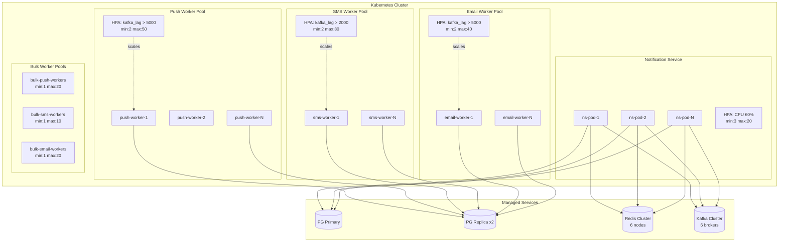

### 20.2 Scaling Dimensions

**Notification Service** scales on CPU. Requests are lightweight (Redis + Postgres write + Kafka produce). At 50ms P99, a single pod handles ~200 req/s. 20 pods = 4,000 req/s sustained.

**Channel Workers** scale on Kafka consumer lag. The HPA uses a custom metric from the Kafka exporter. Lag thresholds are different per channel — SMS workers scale more aggressively because SMS delivery is time-sensitive.

**Database Read Distribution**: workers read from Postgres replicas (notification status checks, preference lookups). Only writes go to the primary. This is important — at 50,000 notifications/min with an average of 2 status updates per notification, primary write load is ~1,600 writes/s, which is within comfortable range for a well-tuned Postgres primary on modern hardware.

**Kafka Partition Count** is the hard ceiling on parallelism within a consumer group. 64 partitions on `notifications.realtime` means the max useful push worker count is 64. Plan partition counts for 3x your expected peak worker count to avoid re-partitioning under load (re-partitioning requires a Kafka migration and causes a brief consumer group rebalance).

### 20.3 Bulk Job Rate Control

Bulk fan-out is rate-limited at the Fan-Out Coordinator level, not at the worker level. The coordinator produces messages to Kafka at a configured rate (default: 1,000/s per channel). Workers consume at whatever rate they can sustain. This approach means bulk jobs are predictably slow rather than unpredictably fast — a 1M-user bulk send takes ~17 minutes at 1k/s, and the ops team can see exactly where it is at any point.

---

## 21. Multi-Region Considerations

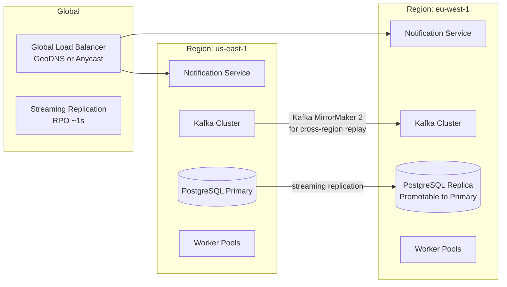

The multi-region setup is active/passive for the database layer. PostgreSQL streaming replication keeps the EU replica within ~1 second of the primary. In a us-east-1 failure, the EU replica is promoted and EU workers start processing against it. Kafka MirrorMaker 2 replicates `notifications.realtime` and `notifications.bulk` across regions so that in-flight messages are not lost.

**Cross-region notification routing**: A user in the EU is still written to the same global Postgres — we do not shard the notification database by region in this design. This simplifies the idempotency model considerably. If EU-local compliance eventually requires data residency (e.g. GDPR), the schema supports a `data_region` column addition and a future split.

**Kafka replication lag** introduces a window where a failover could re-process messages already dispatched in us-east-1. This is the known duplicate risk in multi-region Kafka setups. The worker idempotency checks (status check before dispatch) handle this: workers in EU that pick up a message for a notification already marked `DISPATCHED` will skip it.

---

## 22. Observability and Monitoring

### 22.1 Key Metrics (Prometheus)

```
# Worker throughput
notification_dispatched_total{channel, provider, status}

# Provider latency
notification_provider_latency_seconds{channel, provider, quantile}

# Kafka consumer lag
kafka_consumer_group_lag{topic, partition, consumer_group}

# Circuit breaker state
notification_circuit_breaker_state{provider}  # 0=CLOSED, 1=OPEN, 2=HALF_OPEN

# Retry queue depth
notification_pending_retries_total{channel}

# DLQ depth
notification_dlq_depth_total{channel, reason}

# Reconciliation activity
notification_reconciliation_touched_total{action}  # reset_to_pending, mark_delivered, etc.

# End-to-end latency (time from created_at to dispatched_at)
notification_e2e_latency_seconds{channel, provider, quantile}
```

### 22.2 Distributed Tracing

Every notification carries a `trace_id` from its originating service call. This is stored in `notifications.metadata.trace_id` and propagated in Kafka message headers. Workers initialize a child span from this trace ID. The result is a trace that spans from the original application event, through the Notification Service, Kafka, the worker, and the provider call — end-to-end in Jaeger/Tempo.

This is not optional. Debugging "why didn't user X get their payment notification" without a full trace is a 2-hour investigation. With traces, it's a 2-minute one.

### 22.3 Alerting Thresholds

| Alert | Threshold | Severity | Action |
|---|---|---|---|
| Kafka consumer lag (realtime) | > 10,000 messages for > 5min | P1 | Page on-call |
| DLQ depth | > 500 unresolved for > 15min | P2 | Notify eng channel |
| Circuit breaker OPEN | Any provider | P1 | Page on-call |
| Provider error rate | > 5% over 5min window | P2 | Notify eng channel |
| Reconciliation worker down | No runs in 20min | P2 | Notify eng channel |
| Notifications stuck IN_FLIGHT | > 100 for > 10min | P2 | Notify eng channel |
| E2E latency P95 | > 30s | P1 | Page on-call |

### 22.4 Dashboards

Three dashboards are maintained in Grafana:

**Notification Health Overview**: realtime and bulk throughput, channel success rates, DLQ depth, circuit breaker states, Kafka consumer lag. This is the first dashboard ops checks during an incident.

**Provider Performance**: per-provider latency histograms, error rates by error code, failover frequency, circuit transitions over time.

**Bulk Job Tracker**: progress of active bulk jobs, per-job dispatch rate, estimated completion time, failed percentage.

---

## 23. Security Considerations

**Payload Encryption**: Notification payloads may contain PII (user name, transaction amounts, account fragments). Payloads in the `notifications.payload` column are encrypted at rest using column-level encryption (pgcrypto or a KMS-backed solution). Workers decrypt at processing time using a service account key. Keys are rotated quarterly.

**Webhook Signature Validation**: All inbound provider webhooks are validated against provider-specific signing mechanisms before any processing occurs. Invalid signatures are rejected with 401 and logged. This prevents spoofed delivery receipts from incorrectly marking notifications as delivered.

**API Authentication**: The Notification Service requires a service-to-service JWT signed by the internal auth service. Tokens are scoped to allowed notification types per caller. The payments service can send payment notifications but cannot send marketing notifications.

**Provider Credentials**: Provider API keys are stored in Kubernetes Secrets backed by an external secrets manager (Vault or AWS Secrets Manager). They are never in environment variables in plaintext or in application configuration files.

**Rate Limiting per User**: To prevent notification flooding (whether from a bug or an adversarial caller), per-user rate limits are enforced in Redis before enqueue. Default: max 10 SMS to the same user per hour, max 50 push notifications per hour. These are configurable per notification type — security alerts bypass rate limits; marketing notifications have stricter limits.

**Audit Logging**: All Admin API operations (manual DLQ replay, bulk job cancellation, provider route changes) are written to an immutable audit log with the operator identity, timestamp, and action taken.

---

## 24. Trade-Off Analysis

### 24.1 Kafka vs RabbitMQ

We chose Kafka over RabbitMQ for this system. The key factors:

**For Kafka**: Durable message log with configurable retention means we can replay the event stream for reconciliation and debugging. Partition-based ordering guarantees per-user sequencing without additional coordination. Consumer groups enable multiple independent consumers (push, SMS, email) on the same event without message duplication. Kafka scales to higher throughput with lower operational overhead at our volume.

**For RabbitMQ**: Simpler operational model, native support for delayed messages (useful for retry scheduling), better per-message TTL support. RabbitMQ's priority queues are more natural for the realtime vs bulk separation.

**Decision**: Kafka. The log retention and replay capability is worth the operational overhead. Delayed message support (for retries) is handled via the retry scheduler pattern described in §12.3, which works well and doesn't require a Kafka plugin.

### 24.2 Redis for Idempotency vs Postgres Only

Using Postgres alone for idempotency checks (unique constraint + SELECT) works but adds database load on the hot path. Every inbound request would require a SELECT before the INSERT. At 4,000 req/s, that's 8,000 reads/s on the primary just for idempotency, before any other queries.

Redis as the L1 cache absorbs ~95% of idempotency checks (most callers have well-behaved deduplication windows and the Redis key will be present). Postgres serves as the durability fallback. The trade-off is Redis as an additional operational dependency. The risk of Redis being unavailable (and all requests falling through to Postgres) is acceptable — the system degrades to slower but not broken.

### 24.3 Per-User Partition Ordering vs Round-Robin

Partitioning Kafka messages by `user_id % N` gives per-user ordering but uneven partition load if user IDs are not uniformly distributed. Round-robin gives perfect partition balance but loses per-user ordering.

We chose `user_id % N` because the ordering guarantee is worth the mild imbalance risk. The imbalance risk is mitigated by the fact that user IDs are UUIDs (uniformly distributed). For numeric auto-increment user IDs, this would need to be revisited.

### 24.4 Synchronous vs Asynchronous Provider Calls

The Notification Service returns `202 Accepted` before the worker has dispatched to the provider. This is intentional. A synchronous model (return 200 only after confirmed provider dispatch) would:

- Tie the caller's request latency to provider latency (Sendgrid can take 200-500ms)
- Create back-pressure from provider slowness all the way to the application layer
- Make the system's availability directly dependent on provider availability

The trade-off is that the caller cannot know immediately whether delivery succeeded. They must either poll the status endpoint or wait for a webhook callback. For fintech use cases, this is acceptable — payment confirmations are expected to arrive within seconds, not milliseconds, and callers are designed accordingly.

---

## 25. Failure Scenario Walkthroughs

### Scenario 1: Worker Pod Crashes Mid-Dispatch

**Sequence**: Worker picks up message from Kafka, sets status to `IN_FLIGHT`, acquires Redis dispatch lock, calls provider — provider returns 200 — pod crashes before updating Postgres or committing Kafka offset.

**Result**: 
- Kafka will re-deliver the message to another worker in the consumer group (after `session.timeout.ms`)
- The new worker reads status = `IN_FLIGHT` with a `provider_message_id` set
- Worker checks this is not a valid state for re-dispatch and skips
- Reconciliation worker (running every 5 minutes) finds the notification stuck in `IN_FLIGHT` with a `provider_message_id` and queries the provider's status API
- Provider confirms delivery; reconciliation updates status to `DISPATCHED`

**User impact**: Notification was delivered. No duplicate. Max reconciliation lag: 5 minutes.

---

### Scenario 2: Twilio Outage — SMS Circuit Opens

**Sequence**: Twilio returns 503s. SMS workers hit the failure threshold (5 failures in 30s). Circuit opens. Vonage is the configured fallback.

**Result**:
- New SMS notifications are routed immediately to Vonage — no retries, no delay
- Notifications that failed before the circuit opened are in `PENDING` state with `next_retry_at` set
- Once their retry time arrives, they are re-dispatched — circuit is checked first, Vonage is used
- Twilio circuit transitions to HALF_OPEN after 60s. Probe request sent. If Twilio recovers, circuit closes and it becomes primary again
- If Vonage also fails, both circuits open. Notifications are retried with exponential backoff. If retry window exhausted, DLQ. DLQ processor auto-resolves when any circuit closes.

**User impact**: Slight delay for in-flight SMS at circuit open time. Otherwise transparent.

---

### Scenario 3: Duplicate API Call from Application Service

**Sequence**: Payments service sends a payment_received notification. Network hiccup causes it to retry the same request with the same `idempotency_key`.

**Result**:
- First request: Redis miss → Postgres INSERT → Kafka produce → 202 Accepted with `notification_id`
- Second request (2 seconds later): Redis HIT → 200 OK with same `notification_id`, `status: already_accepted`
- No second Kafka message produced. No second notification row. User receives one notification.

**User impact**: None. Handled transparently.

---

### Scenario 4: Kafka Cluster Unavailable

**Sequence**: Kafka becomes unavailable for 3 minutes (rolling restart, network partition).

**Result**:
- Notification Service writes to Postgres succeed (this continues)
- Kafka produce calls fail — Notification Service returns 503 to callers
- Application services queue the notification request for local retry (their responsibility, not ours)
- Workers stop consuming (no messages available). No new notifications dispatched. Existing `PENDING` notifications will be processed by the retry scheduler once Kafka recovers
- After Kafka recovery, producers resume. Workers resume. Backlog is processed within minutes depending on worker autoscaling response

**User impact**: 3-minute delay in notification delivery. No messages lost (Postgres records exist and will be re-enqueued by the retry scheduler or reconciliation worker).

---

### Scenario 5: Database Primary Failover

**Sequence**: PostgreSQL primary becomes unreachable. Replica is promoted (automated via Patroni or RDS failover, ~30-60 seconds).

**Result**:
- Notification Service: writes fail during failover window. Returns 503. Callers retry.
- Workers: reads from replica are unaffected during failover. Workers continue processing existing `PENDING` notifications.
- After promotion: Notification Service reconnects to new primary. Normal operation resumes.
- The ~30-60 second window of failed writes means some notifications are delayed. No data loss (either the write succeeded before failover, or it didn't happen and the caller retries).

---

## 26. Future Improvements

**Notification Templates and Rendering Service**: Currently, callers must provide fully-rendered payloads. A template service would allow callers to provide structured data and a template ID, with rendering happening inside the notification pipeline. This enables A/B testing of notification copy, locale-aware formatting, and centralized content management without application deploys.

**Push Notification Topic Subscriptions**: Instead of per-user targeting, support topic-based push (FCM topic messaging or APNs collapse keys) for broadcast scenarios. This is more efficient for high-fan-out sends to millions of devices.

**Delivery Analytics**: Extend the webhook ingestion model to capture open rates (email), click-through rates, and dismissal rates. Feed these into a per-user engagement model that informs channel selection (if a user never opens push notifications, prefer email for non-urgent types).

**Postgres Partitioning**: Monthly range partitioning on `notifications.created_at`. This becomes necessary at ~500M rows. The schema is designed to support this addition without a full migration.

**Notification Deduplication by Content Hash**: Beyond idempotency keys (caller-provided), add a content-hash deduplication window: if the same user received a notification with the same content hash in the last N minutes, suppress it. This catches duplicate sends from different callers that don't coordinate on idempotency keys.

**Enhanced Bulk Job Control**: Add pause/resume/cancel operations with mid-job cohort modification. Currently, cancellation stops future fan-out but does not drain already-queued messages. A full implementation requires a job-level filter check in workers.

---

## 27. Final Recommendation

Build this system. The current synchronous, single-provider architecture is not fit for the scale or reliability requirements of a production fintech product. The design described in this RFC is not over-engineered for 1M users — it is appropriately engineered.

The implementation should be phased:

**Phase 1 (Weeks 1-4): Core infrastructure**. Kafka topics, Postgres schema, Notification Service enqueue path, single worker pool (email only), Redis idempotency. This gives you the durable event spine and eliminates silent message loss.

**Phase 2 (Weeks 5-8): Full channel coverage and reliability**. SMS and push workers, retry scheduler, DLQ, circuit breakers, basic reconciliation. This is the reliability layer.

**Phase 3 (Weeks 9-12): Observability and operations**. Distributed tracing, Grafana dashboards, alerting, Admin API, bulk job support. This is the operability layer.

**Phase 4 (Post-launch): Hardening**. Multi-region, Postgres partitioning, DLQ auto-resolution improvements, per-user engagement analytics.

The biggest operational risks to plan for:

1. **Kafka consumer rebalancing** when worker pods scale up/down aggressively. Configure `session.timeout.ms` and `max.poll.interval.ms` carefully. A misconfigured consumer group will thrash during autoscaling events.

2. **PostgreSQL index bloat** on `notifications` as the table grows. Monitor index health weekly and schedule regular `VACUUM ANALYZE` on hot tables.

3. **Provider API key rotation** must be practiced before an incident forces it. Document the rotation procedure and test it in staging.

4. **Bulk job runaway** — a misconfigured bulk job targeting the wrong cohort is the highest-probability incident in the first 6 months. The Admin API cancel operation and the rate limit on the fan-out coordinator are the primary safeguards.

This design gives the engineering team a reliable, observable, and operable notification infrastructure that can grow well beyond 1M users without fundamental redesign.

---

## Appendix A: Multi-Provider Routing Diagram

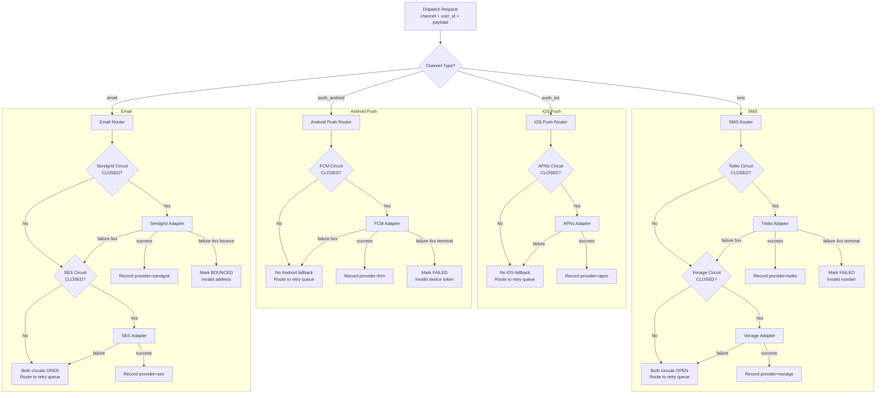

---

## Appendix B: API Reference

### B.1 Enqueue a Notification

```http
POST /v1/notifications
Authorization: Bearer <service-jwt>
Content-Type: application/json
Idempotency-Key: payments-service:payment_received:txn_8f3k2j9:2026052714

{
  "user_id": "usr_01HV2K9MNPQR34STUVWXYZ",
  "channel": "push_android",
  "notification_type": "payment_received",
  "payload": {
    "title": "Payment received",
    "body": "You received $124.50 from Marcus Webb",
    "data": {
      "transaction_id": "txn_8f3k2j9",
      "deep_link": "app://transactions/txn_8f3k2j9"
    }
  },
  "metadata": {
    "trace_id": "4bf92f3577b34da6a3ce929d0e0e4736",
    "source_service": "payments-service",
    "priority": "high"
  },
  "expires_at": "2026-05-27T16:00:00Z"
}
```

**Response — accepted:**
```http
HTTP/1.1 202 Accepted
Content-Type: application/json

{
  "notification_id": "ntf_01HVMK9ABCDEF123456789",
  "status": "PENDING",
  "idempotency_key": "payments-service:payment_received:txn_8f3k2j9:2026052714",
  "created_at": "2026-05-27T14:23:01.482Z"
}
```

**Response — duplicate (idempotency key already seen):**
```http
HTTP/1.1 200 OK
Content-Type: application/json

{
  "notification_id": "ntf_01HVMK9ABCDEF123456789",
  "status": "DISPATCHED",
  "idempotency_key": "payments-service:payment_received:txn_8f3k2j9:2026052714",
  "created_at": "2026-05-27T14:23:01.482Z",
  "already_accepted": true
}
```

---

### B.2 Check Notification Status

```http
GET /v1/notifications/ntf_01HVMK9ABCDEF123456789
Authorization: Bearer <service-jwt>
```

```http
HTTP/1.1 200 OK
Content-Type: application/json

{
  "notification_id": "ntf_01HVMK9ABCDEF123456789",
  "user_id": "usr_01HV2K9MNPQR34STUVWXYZ",
  "channel": "push_android",
  "status": "DELIVERED",
  "provider_name": "fcm",
  "provider_message_id": "projects/myapp/messages/0:1685234581923412%31bd1c9431bd1c94",
  "attempt_count": 1,
  "created_at": "2026-05-27T14:23:01.482Z",
  "dispatched_at": "2026-05-27T14:23:03.109Z",
  "delivered_at": "2026-05-27T14:23:03.891Z"
}
```

---

### B.3 Create a Bulk Job

```http
POST /v1/bulk-jobs
Authorization: Bearer <service-jwt>
Content-Type: application/json

{
  "name": "Q2 statement available",
  "channel": "email",
  "template_id": "tmpl_q2_statement_2026",
  "cohort_query": {
    "filters": [
      { "field": "account_type", "op": "in", "value": ["premium", "business"] },
      { "field": "statement_ready", "op": "eq", "value": true },
      { "field": "email_opt_out", "op": "eq", "value": false }
    ]
  },
  "rate_limit_rps": 500,
  "created_by": "ops-team@company.com"
}
```

```http
HTTP/1.1 202 Accepted

{
  "job_id": "job_01HVMK9BULKABCDEF12345",
  "status": "PENDING",
  "estimated_users": 284312,
  "estimated_duration_minutes": 9
}
```

---

## Appendix C: Provider Webhook Payloads

### C.1 Twilio SMS Status Callback

Twilio POST's to `POST /webhooks/twilio/sms` with form-encoded body:

```
MessageSid=SM1234567890abcdef1234567890abcdef
MessageStatus=delivered
To=%2B14155551234
From=%2B14155559876
ErrorCode=
AccountSid=ACxxxxxxxxxxxxxxxxxxxxxxxxxxxxxxxx
```

Internal normalization:

```json
{
  "provider": "twilio",
  "provider_message_id": "SM1234567890abcdef1234567890abcdef",
  "event_type": "delivered",
  "received_at": "2026-05-27T14:23:08.000Z",
  "raw": { ... }
}
```

---

### C.2 Sendgrid Email Event Webhook

Sendgrid batches events and POST's an array to `POST /webhooks/sendgrid/events`:

```json
[
  {
    "email": "user@example.com",
    "timestamp": 1685234590,
    "event": "delivered",
    "sg_message_id": "14c5d75ce93.dfd.64b469.filter0001.16648.5515E0B88.0",
    "sg_event_id": "sendgrid_internal_event_id",
    "response": "250 OK"
  },
  {
    "email": "bounced@example.com",
    "timestamp": 1685234592,
    "event": "bounce",
    "sg_message_id": "14c5d75ce93.dfd.64b469.filter0001.16648.5515E0B88.1",
    "reason": "550 5.1.1 The email account that you tried to reach does not exist",
    "type": "bounce"
  }
]
```

The webhook receiver normalizes each entry, looks up the `notification_id` by `sg_message_id` from the `delivery_receipts` table (or via a Redis `provider_msg:{sg_message_id}` lookup), and publishes one event per entry to `notifications.webhooks`.

---

### C.3 FCM Downstream Message Error Response

FCM does not POST delivery receipts — it returns errors synchronously in the dispatch response:

```json
{
  "name": "projects/myapp/messages/0:1685234581923412%31bd1c9431bd1c94",
  "error": {
    "code": 404,
    "message": "Requested entity was not found.",
    "status": "NOT_FOUND",
    "details": [
      {
        "@type": "type.googleapis.com/google.firebase.fcm.v1.FcmError",
        "errorCode": "UNREGISTERED"
      }
    ]
  }
}
```

The FCM adapter maps `UNREGISTERED` to our internal `terminal_failure` with `failure_reason = "device_token_unregistered"`. The worker marks the notification `FAILED` and triggers a device token invalidation event so the application layer can clean up the stale token.

---

## Appendix D: Redis Key Reference

```
# Idempotency deduplication
idempotency:{idempotency_key}                    → notification_id (TTL: 24h)

# Dispatch locking — prevents concurrent send by two workers
dispatch_lock:{notification_id}                  → worker_pod_id (TTL: 30s)

# User preference cache
user_prefs:{user_id}                             → JSON{channel→bool} (TTL: 5min)

# Device token cache
device_tokens:{user_id}:{platform}               → [token1, token2] (TTL: 5min)

# Provider circuit breaker state
circuit:{provider_name}:{channel}:state          → CLOSED|OPEN|HALF_OPEN (TTL: dynamic)
circuit:{provider_name}:{channel}:failure_count  → integer (TTL: rolling_window)
circuit:{provider_name}:{channel}:open_at        → unix_timestamp (TTL: wait_duration)

# Per-user rate limiting (sliding window counters)
rate_limit:sms:{user_id}                         → integer (TTL: 1h)
rate_limit:push:{user_id}                        → integer (TTL: 1h)
rate_limit:email:{user_id}                       → integer (TTL: 24h)

# Provider message ID → notification ID reverse lookup (for webhook matching)
provider_msg:twilio:{MessageSid}                 → notification_id (TTL: 72h)
provider_msg:sendgrid:{sg_message_id}            → notification_id (TTL: 72h)

# Bulk job dispatch progress
job:{job_id}:dispatched                          → integer count (TTL: 72h)
job:{job_id}:failed                              → integer count (TTL: 72h)

# Reconciliation advisory lock (maps to pg_advisory_lock equivalent)
recon_lock                                       → worker_pod_id (TTL: 10min)
```

---

*RFC-0041 — Platform Engineering — v1.0*  
*For review questions, contact the Platform team in #platform-eng*
